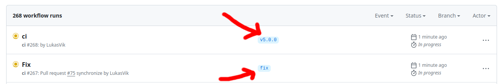

Contribution guide
==================

Information on how to make contributions to the ``hdl-registers`` project.

Setting up development environment
----------------------------------

For development we have a lot more python dependencies than when simply using the package.
Install further dependencies with:

.. code-block:: shell

    python3 -m pip install --upgrade --requirement hdl_registers/requirements_develop.txt

.. _maintain_changelog:

Maintaining changelog
---------------------

We maintain a changelog according to the `keep a changelog <https://keepachangelog.com/>`__ format.
The unreleased changelog in ``doc/release_notes/unreleased.rst`` shall be updated continuously,
not just at release.
Release note files are in the ``rst`` format, inspect older release note files to see the
formatting details.

How to build documentation
--------------------------

Documentation is built using the ``tools/build_docs.py`` script.
The documentation pages have information about python unit test code coverage.
So before building documentation you must run pytest with coverage reports enabled like in CI:

.. code-block:: shell

    python3 -m pytest -v --cov hdl_registers \
      --cov-report xml:generated/python_coverage.xml \
      --cov-report html:generated/python_coverage_html hdl_registers

If want to skip handling of coverage for the documentation there is a flag available in the script,
see ``build_docs.py --help``.

How to make a new release
-------------------------

Releases are made to the Python Packaging Index (PyPI) and can be installed with the python
``pip`` tool.
To make a new release follow these steps.

Test CI status
______________

Before doing anything, launch an Actions workflow run from ``main`` branch to see that everything
works as expected.
The CI environment is stable but due to things like, e.g., new pylint version it can
unexpectedly break.
When the workflow has finished and is green you can move on to the next step.

Review the release notes
________________________

Check the release notes file ``unreleased.rst``.
Fill in anything that is missing according to :ref:`Maintaining changelog <maintain_changelog>`.

Determine new version number
____________________________

We use the `Semantic Versioning <https://semver.org/>`__ scheme.
Read the **Summary** at the top of that page and decide the new version number accordingly.

Run release script
__________________

Run the script

.. code-block:: shell

    python3 tools/tag_release.py X.Y.Z

where X.Y.Z is your new version number.
The script will bump the version number of the Python package, and copy release notes to a new file.
The changes will be committed and then tagged.

Push tag to deploy release
__________________________

.. code-block:: shell

    git push origin vX.Y.Z

**WARNING:** Avoid the "git push --tags" command, which is dangerous since it pushes all your
local tags.

Pushing a tag will create a special Actions run on GitHub:

Usually, CI runs on pull request branches, but this run is on the tag itself.
The run for the tag will execute the additional job ``PyPI release``:

Wait until the workflow is finished and all green, meaning that the release has been deployed
to PyPI.
Visit https://pypi.org/project/hdl_registers/ to make sure that the new release is available.

If anything goes wrong in the CI run, you can delete the tag and start over.

.. code-block:: shell

    git tag --delete vX.Y.Z
    git push origin --delete  vX.Y.Z

**WARNING:** Be extremely careful with this command.
Do not delete any other tags.

Merge release commit
____________________

This step is unnecessarily complicated due to the fact that GitHub does not allow a fast-forward
merge in their Pull Request web UI.
A GitHub repo with linear history will use the "rebase and merge" strategy, which changes the SHA
of the commits.
Hence, the tag that we just pushed will not match any commit on the main branch, if we merge our
release commit via the web UI.
(See https://stackoverflow.com/questions/60597400).

Instead, this has to be done manually on the command line, and can only be done by a user with
complete privileges to the repository.

.. code-block:: shell

    git push origin HEAD:main

**WARNING:** Be very careful with this command and inspect locally that you do not push anything
else than intended.
