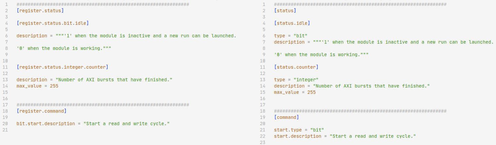

.. _new_data_file_format:

New data file format in version 6.0.0
=====================================

In version 6.0.0 of hdl-registers, the data file (TOML, JSON, etc) format is updated in a way
that is not compatible with older files.
This is done to enable the most requested feature in the history of the tool:
The ability to group register fields arbitrarily, and not by field type.
This is discussed in `#116 <https://github.com/hdl-registers/hdl-registers/issues/116>`__.

When the register parser in hdl-registers encounters an old data file, it will be automatically
upgraded to the new format.
The updated file will be saved next to the old file so that the user can inspect all changes
that were made.
Note that any comments or manual editing of the data file will be lost.

Example
-------

Old format (left) vs new format (right) is shown below.
You can right-click and open to view in full size.

Background
----------

Before version 6.0.0 and since 2017, data was formatted like this:

  **register**.register_name.\ **mode**

  | **register**.register_name.\ **bit**.field_name_1.\ **description**
  | **register**.register_name.\ **bit**.field_name_1.\ **default_value**

  | **register**.register_name.\ **integer**.field_name_2.\ **description**
  | **register**.register_name.\ **integer**.field_name_2.\ **default_value**

  | **register**.register_name.\ **bit**.field_name_3.\ **description**
  | **register**.register_name.\ **bit**.field_name_3.\ **default_value**

In this representation, it was impossible to group fields in a manual order.
All bits would be bundled together, and all integers, etc.
In the example above, ``field_name_1`` and ``field_name_3`` would be placed together,
and ``field_name_2`` would be placed after them.

As of version 6.0.0, the data is formatted like this:

  register_name.\ **mode**

  | register_name.field_name_1.\ **type** = "**bit**"
  | register_name.field_name_1.\ **description**
  | register_name.field_name_1.\ **default_value**

  | register_name.field_name_2.\ **type** = "**integer**"
  | register_name.field_name_2.\ **description**
  | register_name.field_name_2.\ **default_value**

  | register_name.field_name_3.\ **type** = "**bit**"
  | register_name.field_name_3.\ **description**
  | register_name.field_name_3.\ **default_value**

With this format, fields are placed in exactly the same order as they appear in the data file.
No matter their type.
Same goes for registers and register arrays.
Previously, all registers would always be placed before all register arrays,
no matter the order they appeared in the data file.
With this new data file format, registers and register arrays are placed in exactly the order they
appear in the data file.

Specification and documentation
-------------------------------

Example of data in the new file format can be found in all the examples on this website.
For example here: :ref:`toml_formatting`.

Format specifications are found in the corresponding articles in the menubar on the left.
For example, if you are curious about how to specify a bit vector field,
go to :ref:`field_bit_vector`.
