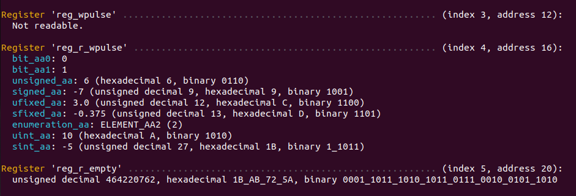

.. _generator_python:

Python code generator
=====================

The Python code generator creates an accessor class for reading, writing and printing register and
field values.
The class will have a named method for each of these operations on each register and field.
The methods use native Python types (e.g. ``int``, ``float``, ``Enum``) to represent values that
are read or written.
This means that the user never has to do any bit slicing or casting.

* :class:`.PythonPickleGenerator` saves a Python :py:mod:`pickle` file containing the
  :class:`.RegisterList`, along with a small wrapper file to recreate the object.
* :class:`.PythonAccessorGenerator` creates a Python class with methods to read/write/print each
  register and field.

These can be used in a Python-based system test environment to conveniently perform register
read/writes on the target device.

.. _generator_python_generate_code:

The artifacts are generated like this:

.. literalinclude:: py/generator_python.py
   :caption: Python code that parses the example TOML file and generates Python register artifacts.
   :language: Python
   :linenos:
   :lines: 10-

Pickle code
-----------

The script below is generated by the :class:`.PythonPickleGenerator` and can be used to re-create
the :class:`.RegisterList` object from the Python :py:mod:`pickle` file.

.. collapse:: Click to expand/collapse code.

  .. literalinclude:: ../../../../generated/sphinx_rst/register_code/generator/generator_python/example.py
     :caption: Example Python pickle re-creation script
     :language: Python
     :linenos:

|

Accessor code
-------------

The class :ref:`below <python_accessor_code>` is generated by the :class:`.PythonAccessorGenerator`
for performing register and field operations on a target device.
Interesting things to notice:

1. Register read/write operations use a generated Python :py:mod:`dataclass <dataclasses>` to
   represent a register with field value members.
   See e.g. ``read_config`` and ``write_config``, and the ``ExampleConfigValue`` type in
   the :ref:`generated code <python_accessor_code>`.

2. Field values are represented using native Python types.

  a. A :ref:`bit field <field_bit>` is represented as a Python ``int``.

  b. A :ref:`bit vector field <field_bit_vector>` WITHOUT fractional bits,
     whether signed or unsigned, is represented as a Python ``int``.

  c. A :ref:`bit vector field <field_bit_vector>` WITH fractional bits,
     whether signed or unsigned, is represented as a Python ``float``.

  d. An :ref:`enumeration field <field_enumeration>` is represented using a custom Python
     :py:mod:`Enum <enum>` type.
     See e.g. ``ExampleConfigValue.Direction``.

  e. An :ref:`integer field <field_integer>`, whether signed or unsigned, is represented as a
     Python ``int``.

3. In cases where the register has no fields, the read and write use a plain integer instead.
   See e.g. ``read_status``.

4. Each writeable register has methods to write

   a. The entire register value (e.g. ``write_config``), which takes a dataclass value as argument.

   b. Individual field values (e.g. ``write_config_direction``), which takes the native Python
      field representation as argument.

   Field write methods will either read-modify-write or plain write the register, depending on what
   the :ref:`register mode <basic_feature_register_modes>` allows.

Printing values
_______________

Each register value type has a ``to_string`` method to convert the field values to a
human-readable string.
The accessor class also implements the ``print_registers`` method, which will print all register
and field values:

  Example register printout with many fields of different types.

Note how only readable registers are printed.
Field values are present firstly as their native type, but also as their decimal, hexadecimal and
binary encodings.

Color
~~~~~

By default, color output is enabled, since it improves readability when a lot of information
is presented.
It can be turned of by setting the ``no_color`` argument to ``print_registers``, or by setting
the environment variable ``NO_COLOR`` to any value.

Register accessor interface
___________________________

The :ref:`code <python_accessor_code>` generated by :class:`.PythonAccessorGenerator` performs
the address calculation, mode logic, bit slicing, and type casting for you.
It can not, however, implement the actual reading and writing of register values on your
target device.
This must be implemented by the user, given the methods of access that are available
in your environment (SSH, telnet, UART, etc).
Hdl-registers can not implement this in a generic way that is useful in all environments, since
device setup is so different in different projects.

The :ref:`class constructor <python_accessor_code>` takes a ``register_accessor`` argument of type
:class:`.PythonRegisterAccessorInterface`.
This object must be constructed by the user, must inherit the
:class:`.PythonRegisterAccessorInterface`, and must implement the ``read_register`` and
``write_register`` methods.
See the :class:`API documentation <.PythonRegisterAccessorInterface>` for more details.

.. _python_accessor_code:

Code
____

Example code generated by :class:`.PythonAccessorGenerator`.
Using the generated code is done by

1. Generating artifacts as shown :ref:`here <generator_python_generate_code>`.
2. Adding the generated Python module to your Python PATH.
3. Instantiating the object, by either

  a. Class instantiation, e.g. ``accessor = ExampleAccessor(register_accessor=register_accessor)``,
     where "Example" in the class name is the name of the register list.
  b. Running the convenience function
     ``accessor = get_accessor(register_accessor=register_accessor)`` where the register list
     name is not needed anywhere.

.. literalinclude:: ../../../../generated/sphinx_rst/register_code/generator/generator_python/example_accessor.py
   :caption: Example Python accessor class
   :language: Python
   :linenos:
